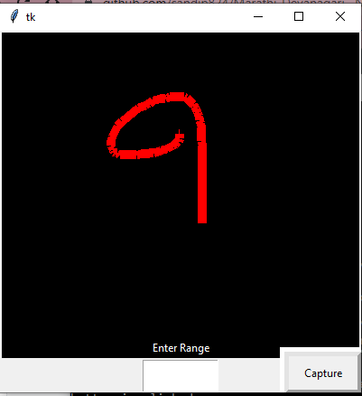

## Data Collection for Marathi hand written digits 
  

### Installation

1. Clone the repo
   ```sh
   git clone https://github.com/sandip824/Marathi-Devanagari-_Numbers_classifier.git
   ```
2. Create a virtual ebvirnment to install all the dependencies
3. Install dependencies
4. ```sh
   pip install python-tk
   pip install Pillow
   ```
   
  


<!-- USAGE EXAMPLES -->
## Usage
Run main.py to open the main data collection applicatio, set the required counter to collect number of images to be collected for perticular digits.
collects number of samples for everu digits. After collecting desired number of images with this tool use the pre-process script to conver this collected data in to standers MNIST data formart.
