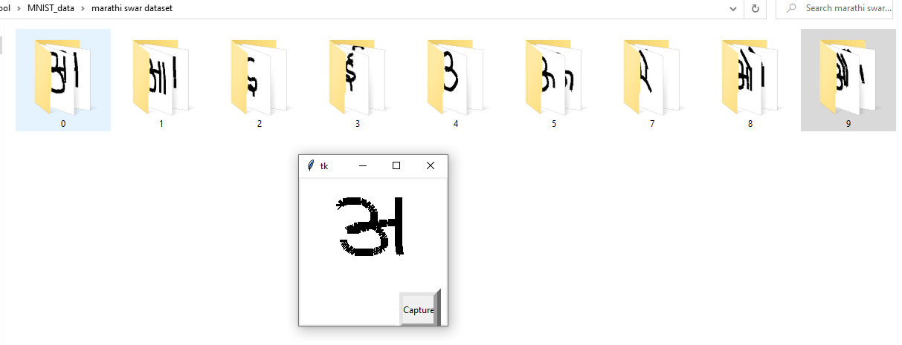
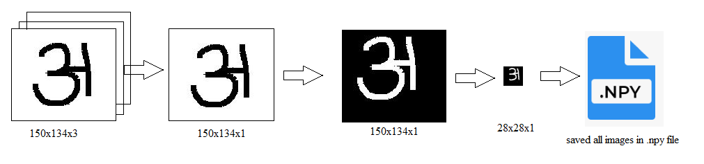
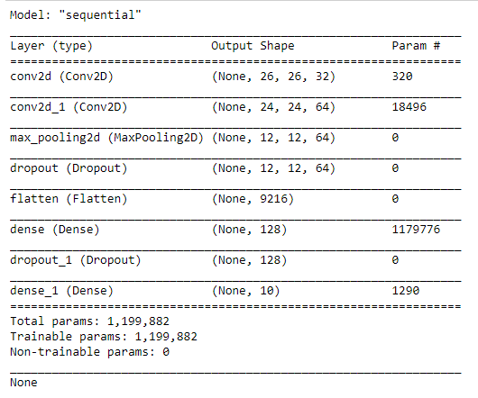
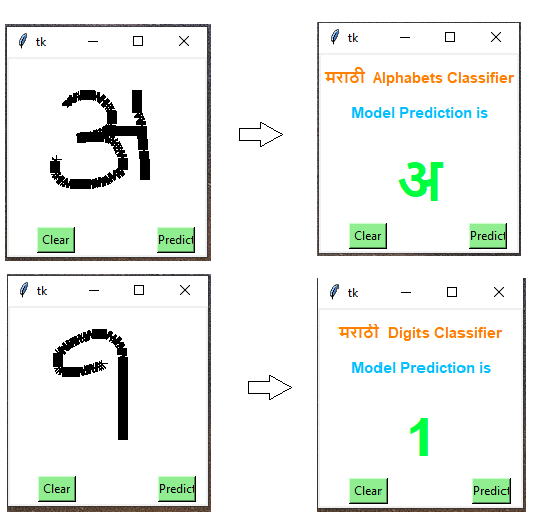

# Marathi-Devanagari-_Numbers_classifier

### Installation

1. Clone the repo
   ```sh
   git clone https://github.com/sandip824/Marathi-Devanagari-_Numbers_classifier.git
   ```
2. Create a virtual ebvirnment to install all the dependencies
3. Install dependencies
4. ```sh
   pip install python-tk
   pip install Pillow
   ```
  
## Usage

### Data collection


### Data Pre-Processing

### Model Training

### Model Deployment

## Results
https://user-images.githubusercontent.com/47384889/132085124-51d2834a-5399-4e35-8a15-ec97ff33aa4a.mov

